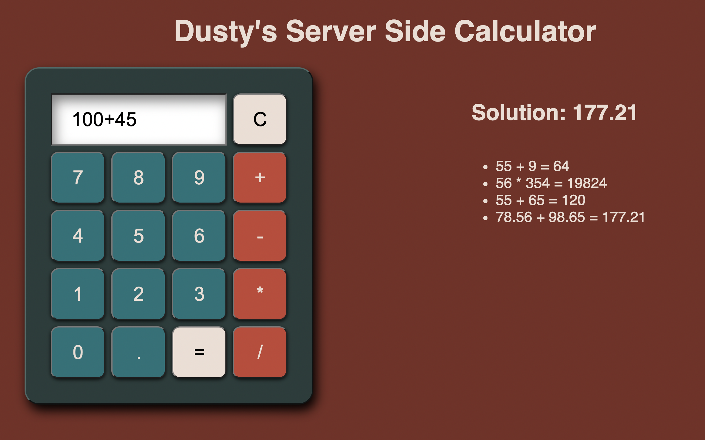

# Dusty's Server Side Calculator

## Description

Duration: 1 Weekend

This app acts as a simple calculator that can take in two number values and an operator and return the solution. A list on the webpage shows the history of each equation made as well as their solutions. There is a clear button to clear out the input for new equations each time.

## Screenshot

## Usage

1. User inputs first operand by pressing number or decimal buttons
2. User chooses which operator to use in the operation by pressing one of the relevant buttons
3. User inputs second operand by pressing number or decimal buttons
4. Once desired operation has been input to completion, pressing the = button will submit to server for calculations
5. Answer will display next to "Solution" on the webpage.
6. A history of answers will be displayed under the last solution.
7. The "C" (clear) button will clear out whatever input has been put in.

## Built With

This server side calculator is built with HTML, CSS, Javascript, jQuery, NODE, Express, and AJAX.

## Acknowledgement

Thanks to Prime Digital Academy who equipped and helped me to make this application a reality, as well as my classmates who gave me tips and pointers along the way.
